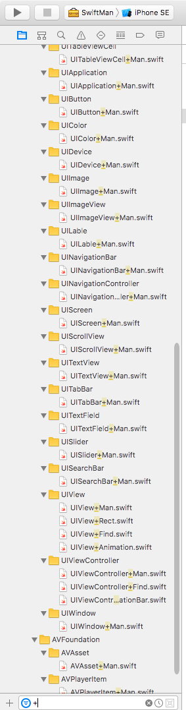

# SwiftMan

 
[](https://github.com/Carthage/Carthage)
<a href="https://img.shields.io/cocoapods/v/ZFPlayer.svg"></a>
[](http://cocoadocs.org/docsets/EZPlayer)


## Requirements:

- iOS 8.0+ 
- Xcode 8.1+
- Swift 3.0+

## Features

Swift extensions and utils classes

## Preview



## Installation

### ExportFramework
run buildFramework script
### Carthage

[Carthage](https://github.com/Carthage/Carthage) is a decentralized dependency manager that builds your dependencies and provides you with binary frameworks.

You can install Carthage with [Homebrew](http://brew.sh/) using the following command:

```bash
$ brew update
$ brew install carthage
```

To integrate SwiftMan into your Xcode project using Carthage, specify it in your `Cartfile`:

```ogdl
github "easyui/SwiftMan" 
```

Run `carthage update` to build the framework and drag the built `SwiftMan.framework` into your Xcode project.

### CocoaPods

[CocoaPods](http://cocoapods.org) is a dependency manager for Cocoa projects. You can install it with the following command:

```bash
$ gem install cocoapods
```

To integrate SwiftMan into your Xcode project using CocoaPods, specify it in your `Podfile`:

```ruby
source 'https://github.com/CocoaPods/Specs.git'
platform :ios, '8.0'
use_frameworks!

target '<Your Target Name>' do
    pod 'SwiftMan'
end
```

Then, run the following command:

```bash
$ pod install
```


